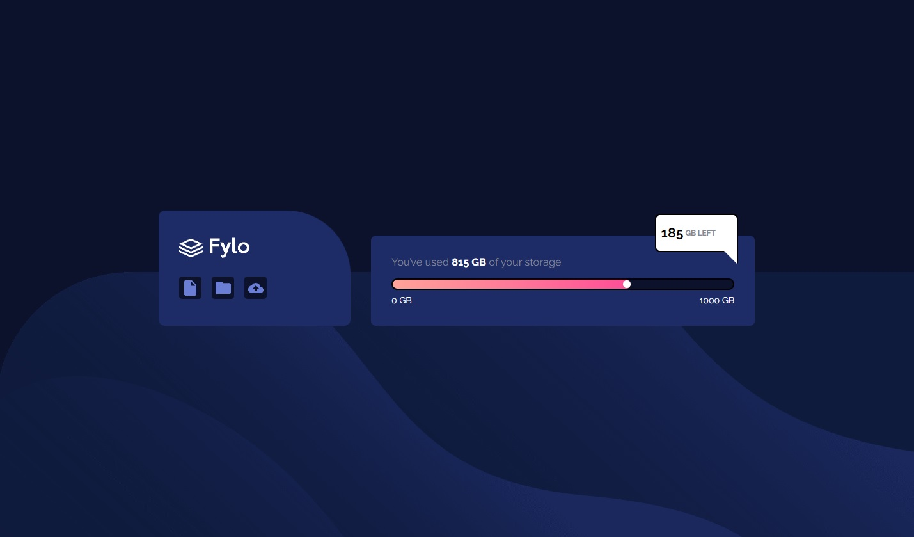

# Frontend Mentor - Fylo data storage component

## Welcome! 👋

Thanks for checking out this front-end coding challenge.

## Table of contents

- [Built with](#built-with)
- [What I learned](#what-i-learned)
- [Author](#author)

### Built with

- Semantic HTML5 markup
- CSS custom properties
- Flexbox

### What I learned

I have learned how to speech bubble with CSS.

## Author

- Frontend Mentor - [bayindirhsncn](https://www.frontendmentor.io/profile/bayindirhsncn)
- LinkedIn - [hasancan-bayindir](https://www.linkedin.com/in/hasancan-bayindir/)
